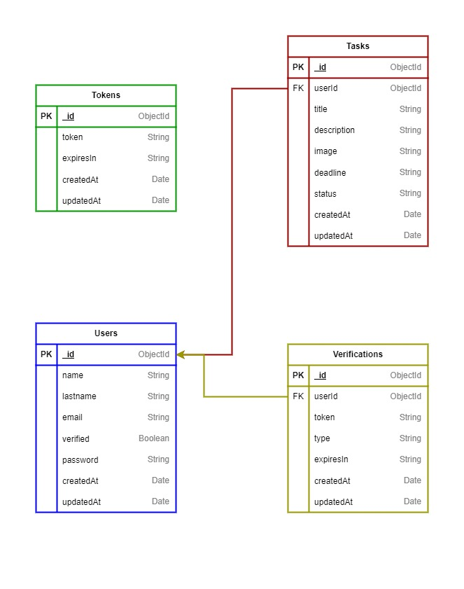

# ReactTasks Backend

Este es la **api** para el proyecto **ReactTasks**, una aplicación web para gestionar tareas. Este documento contiene 
explicaciones sobre las tecnologías utilizadas, el entorno de desarrollo, base de datos, cómo ejecutar el servidor y 
test de la aplicación.

<br>

<p align="center">
  
</p>

<p align="center">
  <a href="https://creativecommons.org/licenses/by/4.0">
    
  </a>
  <a href="https://api.reacttasks.com">
    
  </a>
</p>

<br>

## Indice
- [1) Tecnologías](#technologies)
  - [1.1) Express](#technologies-express)
  - [1.2) Typescript](#technologies-typescript)
  - [1.3) MongoDB](#technologies-mongodb)
  - [1.4) Mongoose](#technologies-mongoose)
  - [1.5) JWT](#technologies-jwt)
  - [1.6) BetterStack Logtail](#technologies-betterstack-logtail)
  - [1.7) Docker](#technologies-docker)
  - [1.8) Jest](#technologies-jest)
  - [1.9) SuperTest](#technologies-supertest)
  - [1.10) Enlaces](#technologies-links)
- [2) Entorno de desarrrollo](#development-environment)
  - [2.1) Node.js](#development-environment-node)
  - [2.2) Pnpm (opcional)](#development-environment-pnpm)
  - [2.3) Docker Desktop (opcional)](#development-environment-docker-desktop)
  - [2.4) MongoDBCompass (opcional)](#development-environment-mongodbcompass)
  - [2.5) Draw.io](#development-environment-drawio)
  - [2.6) Postman (opcional)](#development-environment-postman)
  - [2.7) Enlaces](#development-environment-links)
- [3) Base de datos](#database)
  - [3.1) Collections](#database-collections)
  - [3.2) Draw.io](#database-drawio)
  - [3.3) Comandos](#database-commands)
    - [3.3.1) db:mount](#database-commands-mount)
    - [3.3.2) db:unmount](#database-commands-unmount)
    - [3.3.3) db:start](#database-commands-start)
    - [3.3.4) db:stop](#database-commands-stop)
    - [3.3.5) db:seed](#database-commands-seed)
- [4) Levantar proyecto](#run-project)
  - [4.1) Clonar repositorio](#run-project-clone-repository)
  - [4.2) Rama de desarrollo](#run-project-development-branch)
  - [4.3) Variables de entorno](#run-project-environment-variables)
  - [4.4) Crear base de datos](#run-project-create-database)
    - [4.4.1) Docker](#run-project-create-database-docker)
    - [4.4.2) MongoDB](#run-project-create-database-mongodb)
    - [4.4.3) Mongo URL](#run-project-create-database-mongodb-url)
  - [4.5) Envio de correos](#run-project-send-email)
  - [4.6) Token de Logtail (solo rama main)](#run-project-logtail-token)
  - [4.7) Instalar dependencias](#run-project-install-dependencies)
  - [4.8) Levantar API](#run-project-start-api)
  - [4.9) Endpoints](#run-project-endpoints)
- [5) Test](#test)
  - [5.1) Rama testing](#test-testing-branch)
  - [5.2) Seedear base de datos](#test-seed-database)
  - [5.3) Correr test](#test-run-tests)
    - [5.3.1) Unit Test](#test-run-unit-tests)
    - [5.3.2) End-to-End (e2e) Test](#test-run-e2e-tests)
  - [5.4) Coverage](#test-coverage-tests)
  - [5.5) Watch](#test-watch-tests)

<br>

<a name="technologies"></a>
## 1) Tecnologías

<a name="technologies-express"></a>
### 1.1) Express
Es un **popular framework de aplicaciones web para Node.js**, que se utiliza para crear aplicaciones web y servicios web 
basados en el protocolo HTTP. Express es una **capa delgada sobre Node.js y proporciona una amplia gama de características** 
para la creación rápida y fácil de aplicaciones web robustas.

<a name="technologies-typescript"></a>
### 1.2) Typescript
Es un lenguaje de programación libre y de código abierto desarrollado y mantenido por Microsoft. Es un **superconjunto 
de JavaScript**, que esencialmente añade tipos estáticos y objetos basados en clases. **Extiende la sintaxis de JavaScript**, 
por tanto, cualquier código JavaScript existente debería funcionar sin problemas.

Soporta **ficheros de definición** que contengan información sobre los tipos de librerías JavaScript existentes, similares 
a los ficheros de cabeceras de C/C++ que describen la estructura de ficheros de objetos existentes. Esto permite a otros 
programas usar los valores definidos en los ficheros como si fueran entidades TypeScript de tipado estático.

<a name="technologies-mongodb"></a>
### 1.3) MongoDB
MongoDB es un **sistema de base de datos NoSQL**, lo que significa que **no utiliza el modelo relacional tradicional** de las 
bases de datos SQL. En su lugar, MongoDB utiliza un **formato de almacenamiento de documentos JSON** con esquemas dinámicos, 
lo que permite una mayor flexibilidad y escalabilidad en la estructura de los datos. 

MongoDB es conocido por su **capacidad de manejar grandes volúmenes de datos** y su capacidad de escalar horizontalmente a 
través de la distribución en clústeres. Además, ofrece un lenguaje de consulta poderoso y flexible que permite realizar 
consultas complejas y análisis en los datos almacenados.

<a name="technologies-mongoose"></a>
### 1.4) Mongoose
Mongoose es una **herramienta de modelado de datos** para MongoDB en Node.js. Proporciona una **solución sencilla y basada 
en esquemas** para modelar la aplicación de datos de MongoDB. Mongoose se utiliza comúnmente en aplicaciones Node.js que 
interactúan con bases de datos MongoDB.

Al utilizar Mongoose, los desarrolladores pueden **definir modelos de datos con esquemas** que representan la estructura 
de los documentos en la base de datos MongoDB. Esto proporciona una **capa de abstracción sobre la base de datos**, lo que 
facilita la validación de datos, la definición de relaciones y la manipulación de datos.

<a name="technologies-jwt"></a>
### 1.5) JWT
JWT **(JSON Web Token) es un estándar** qué está dentro del documento RFC 7519.

En el mismo se define un **mecanismo para poder propagar entre dos partes**, y de forma segura, la identidad de un 
determinado usuario, además con una serie de claims o privilegios.

Estos **privilegios están codificados en objetos de tipo JSON**, que se incrustan dentro de del payload o cuerpo de un 
mensaje que va firmado digitalmente.

<a name="technologies-betterstack-logtail"></a>
### 1.6) BetterStack Logtail
BetterStack es una **plataforma de desarrollo de software** que ofrece herramientas y servicios para ayudar a los equipos de 
ingeniería y desarrollo a **crear, implementar y administrar aplicaciones web de manera eficiente.** Se centra en ofrecer una 
serie de servicios y productos que cubren diversas áreas del desarrollo de software.

Uno de ellos es **BetterStack Logtail**, un servicio de **recopilación y análisis** de registros (logs) que ayuda a los 
equipos a **rastrear y diagnosticar problemas en las aplicaciones.** Los usuarios pueden enviar de forma sencilla los 
registros generados por sus aplicaciones y sistemas a diferentes destinos de almacenamiento y análisis.

<a name="technologies-docker"></a>
### 1.7) Docker
Una **plataforma de código abierto** que permite la **creación, el despliegue y la ejecución de aplicaciones en contenedores.** 
Un contenedor es una **unidad de software ligera y portátil que encapsula una aplicación** y todas sus dependencias, incluidas bibliotecas, marcos de trabajo y archivos de configuración necesarios para que la **aplicación se ejecute de manera eficiente 
y confiable en diferentes entornos.**

Docker facilita la creación y el despliegue de aplicaciones al proporcionar una forma consistente de empaquetar, distribuir y 
ejecutar software. Además, permite **la gestión eficiente de recursos**, ya que los contenedores son **livianos y comparten el 
núcleo del sistema operativo,** lo que los hace rápidos de crear y lanzar. Docker también **ofrece herramientas para administrar 
y orquestar múltiples contenedores,** como Docker Compose y Kubernetes, que simplifican la gestión de aplicaciones distribuidas 
y escalables.

<a name="technologies-jest"></a>
### 1.8) Jest
Es la **herramienta de Test más popular** y recomendada para React. Es creado por Facebook. Jest no es solo una biblioteca, 
es un marco de prueba. Significa que **viene con una biblioteca de afirmaciones, un corredor de pruebas y soporte** para 
cosas. Como ha sido diseñado específicamente para probar las aplicaciones React, también se puede utilizar en otros marcos 
de JavaScript.

<a name="technologies-supertest"></a>
### 1.9) SuperTest
Supertest es una biblioteca de Node.js que permite **realizar pruebas de integración** para aplicaciones web. Es una **extensión**
de la biblioteca de aserciones de pruebas de Node.js, llamada ```assert```, que proporciona una interfaz para **enviar solicitudes 
HTTP** a una aplicación web y comprobar la respuesta.

Funciona de manera **similar a un cliente HTTP,** pero está diseñada específicamente para pruebas de integración. Permite 
enviar solicitudes HTTP a una aplicación web y comprobar la respuesta de la aplicación.

<a name="technologies-links"></a>
### 1.10) Enlaces
 * [Express](https://expressjs.com)    
 * [TypeScript](https://www.typescriptlang.org)  
 * [MongoDB](https://www.mongodb.com/es)  
 * [Mongoose](https://mongoosejs.com)  
 * [JWT](https://jwt.io)
 * [BetterStack Logtail](https://betterstack.com/logs)
 * [Docker](https://www.docker.com)
 * [Jest](https://jestjs.io)
 * [SuperTest](https://github.com/ladjs/supertest)

<br>

<a name="development-environment"></a>
## 2) Entorno de desarrollo
El entorno se compone de lass herramientas que son necesarios para ejecutar la aplicación y realizar interacciones con ella,
por ejemplo, enviar solicitudes HTTP, crear base de datos, etc. Esas herramientas son:

<a name="development-environment-node"></a>
### 2.1) Node.js
Es un **entorno en tiempo de ejecución multiplataforma para la capa del servidor** (en el lado del servidor) basado en 
JavaScript. Controlado por eventos, diseñado para crear aplicaciones escalables, permitiéndote establecer y gestionar 
múltiples conexiones al mismo tiempo. Gracias a esta característica, no tienes que preocuparte con el bloqueo de procesos, 
pues no hay bloqueos.

Node.js está **basado en el motor V8 de Google**, uno de los intérpretes de lenguaje de programación que existen. Este motor 
se encarga de compilar el código de JavaScript en código de máquina, un código de nivel más bajo que no hace falta que 
sea interpretado por el navegador.

<a name="development-environment-pnpm"></a>
### 2.2) Pnpm (opcional)
Es un **gestor de paquetes de JavaScript** para aplicaciones web y Node.js. Es una **alternativa a npm y yarn,** dos de los 
gestores de paquetes más populares de la industria.

Pnpm se destaca por su **enfoque en el rendimiento y la eficiencia.** En lugar de descargar cada paquete en el directorio 
de node_modules de cada proyecto, pnpm **utiliza un único almacén central para todos los paquetes instalados en un sistema,** 
lo que significa que los paquetes se descargan una sola vez y se comparten entre los diferentes proyectos. Esto **reduce el 
tamaño de los proyectos y acelera el proceso de instalación** de paquetes.

<a name="development-environment-docker-desktop"></a>
### 2.3) Docker Desktop (opcional)
Docker Desktop es una aplicación que proporciona una **experiencia de usuario** completa de Docker en **sistemas operativos 
de escritorio, como Windows y macOS.** Es una herramienta que **facilita la instalación y el uso de Docker en entornos de 
desarrollo local.** Obtienes un entorno de desarrollo aislado donde puedes **crear y ejecutar contenedores en tu sistema 
operativo** sin interferir con otros programas o configuraciones. Proporciona una **forma rápida y consistente de configurar 
un entorno de desarrollo** para proyectos que utilizan contenedores.

<a name="development-environment-mongodbcompass"></a>
### 2.4) MongoDBCompass (opcional)
Una **herramienta visual** de interfaz de usuario que proporciona una forma intuitiva de trabajar con bases de datos MongoDB. 
Permite a los desarrolladores y administradores de bases de datos **explorar, analizar y manipular sus datos** de una manera 
más eficiente y efectiva.

Ofrece **características de analítica y optimización de rendimiento**, lo que permite a los usuarios comprender mejor el 
rendimiento de sus consultas y operaciones en la base de datos. Además, integra **capacidades de administración de clústeres**, 
lo que facilita la supervisión y gestión de entornos de base de datos distribuidos.

<a name="development-environment-drawio"></a>
### 2.5) Draw.io
Es un **software de dibujo gráfico multiplataforma gratuito y de código abierto** desarrollado en HTML5 y JavaScript. Su 
interfaz se puede **utilizar para crear diagramas** como diagramas de flujo, estructuras alámbricas, diagramas UML, organigramas 
y diagramas de red.

<a name="development-environment-postman"></a>
### 2.6) Postman (opcional)
Postman es una plataforma de colaboración para el desarrollo de APIs. Permite a los desarrolladores diseñar, crear, probar y 
documentar APIs de forma eficiente. Con Postman, los desarrolladores pueden enviar solicitudes HTTP a través de una interfaz 
fácil de usar, lo que les permite probar la funcionalidad de sus APIs antes de implementarlas en sus aplicaciones.

Ofrece herramientas para la automatización de pruebas, la generación de documentación y la colaboración en equipo, lo que lo 
convierte en una herramienta integral para el desarrollo de APIs. También proporciona características avanzadas como la 
gestión de entornos, monitoreo y la posibilidad de compartir colecciones de pruebas con otros miembros del equipo. En resumen, 
Postman es una herramienta poderosa que simplifica el proceso de desarrollo y prueba de APIs.

Como se observa solo **Node.js y Draw.io son totalmente obligatorios,** los otros pueden ser reemplazados por programas de tu 
preferencia, en el caso de **Pnpm** puedes sustituirlo por el **gestor de depdencias de Javascript** que desees, sea **npm** o 
**yarn**, pero asegurate de que al cambiarlo borres el archivo ```pnpm-lock.yaml```, siguiendo con **Docker** se puede usar 
**cualquier programa** que permita montar una base de datos de MongoDB, **MongoDBCompass** puede ser reemplazado por otro 
programa que **acepte conexiones de MongoDB**, por útimo, si no quieres usar **Postman** puedes utilizar el **cliente http** 
de tu preferencia.

<a name="development-environment-links"></a>
### 2.7) Enlaces
 * [Node.js](https://nodejs.org)
 * [Pnpm](https://pnpm.io)
 * [Docker Desktop](https://www.docker.com)
 * [MongoDBCompass](https://www.mongodb.com/es/products/tools/compass)
 * [Draw.io](https://www.diagrams.net)
 * [Postman](https://www.postman.com)

<br>

<a name="database"></a>
## 3) Base de datos
Como se observa la **base de datos es MongoDB**, la que cubre las necesidades de este backend; además que para este caso
los requerimientos apuntan a que puede usarse una **base de datos sql o no sql**, pero por aprendizaje se ha decidido usar 
MongoDB, aquí un diagrama con la estructura de la base de datos:

<br>



<a name="database-collections"></a>
### 3.1) Collections
Para este caso se tienen un total de 4 colecciones: ```users```, ```tasks```, ```tokens``` y ```verifications```. Teniendo 
cada una sus repectivas reglas y restricciones para el correcto uso de la misma.

<a name="database-drawio"></a>
### 3.2) Draw.io
Como se vio en la parte del entorno de desarrollo, se uso **draw.io** para crear el **diagrama de la base de datos**, en la 
**carpeta docs** está tanto el archivo drawio y como la imagen de la base de datos, está en **todas las ramas**. Para poder 
editarlo **solo abra el programa Draw.io** y busque el archivo.

<a name="database-commands"></a>
### 3.3) Comandos
En el package.json hay varios scripts que comienzan por ```db:```, estos son para realizar distintas acciones con la base 
de datos. Estos scripts solo se encuentran en las ramas ```development``` y ```testing``` del proyecto.

<a name="database-commands-mount"></a>
#### 3.3.1) db:mount
Este comando le permite montar la base de datos de MongoDB. Por debajo ejecuta el comando ```docker compose up -d```, por lo que 
para que funcione debe tener docker instalado y activado. Si se ejecuta con exito creará una carpeta llamada ```mongo```, donde 
se guardará la base de datos.

```zsh
pnpm db:mount
```

<a name="database-commands-unmount"></a>
#### 3.3.2) db:unmount
Este comando se encarga de desmontar la base de datos de MongoDB. Por debajo ejecuta el comando ```docker compose down --volumes```,
por lo que para que funcione debe tener docker instalado y activado.

```zsh
pnpm db:unmount
```

<a name="database-commands-start"></a>
#### 3.3.3) db:start
Este comando se encarga de iniciar la base de datos de MongoDB. Por debajo ejecuta el comando ```docker compose start```, antes 
se debe ejecutar el comando ```db:mount```. Como usa docker, asegurese de tener docker instalado y activado.

```zsh
pnpm db:start
```

<a name="database-commands-stop"></a>
#### 3.3.4) db:stop
Este comando se encarga de detener la base de datos de MongoDB. Por debajo ejecuta el comando ```docker compose stop```.

```zsh
pnpm db:stop
```

<a name="database-commands-seed"></a>
#### 3.3.5) db:seed
Este comando se encarga de insertar datos de prueba en la base de datos. Este script ejecuta el archivo seed.ts dentro de la 
carpeta script del módulo database.

```zsh
pnpm db:seed
```

<br>

<a name="run-project"></a>
## 4) Levantar proyecto
En este punto se mostraran los pasos para levantar el API.

<a name="run-project-clone-repository"></a>
### 4.1) Clonar repositorio
Lo primero es clonar el repositorio de git, para ello abra una terminal (cmd, powershell, gitzsh, etc.) y escribe el siguiente 
comando:

```zsh
git clone https://github.com/KristhDev/ReactTasks-backend.git
```

<a name="run-project-development-branch"></a>
### 4.2) Rama de desarrollo
Como habrá notado el proyecto está dividido en varías ramas, así que una vez clonado el repositorio hay que cambiar a la rama
```development``` con el siguiente comando:

```zsh
git switch development
```

<a name="run-project-environment-variables"></a>
### 4.3) Variables de entorno
En el package.json hay un script ```env:create``` que se encarga de **crear el archivo .env** con las variables de 
entorno que se necesitan para el proyecto, en dependecia de la rama las variables de entorno cambian, cabe aclarar que 
solo en la rama ```main``` no existe este comando. Para crear el archivo .env ejecute el siguiente comando:

```zsh 
pnpm env:create
```

Le dejo una tabla con explicaciones de cada variable de entorno:

| Nombre de la variable   | Explicación                                                                    | Ramas                  |
|-------------------------|--------------------------------------------------------------------------------|------------------------|
| AUTH_SECRET             | Es una cadena de caracteres para proteger algunas rutas de de auntenticación (se genera cuando se crea el archivo .env) | main - development - testing |
| CLIENT_URL              | Es la url del cliente o frontend de la aplicación                              | main - development - testing |
| CLOUDINARY_API_KEY      | Es la clave de la API de Cloudinary                                            | main - development - testing |
| CLOUDINARY_API_SECRET   | Es la clave secreta de la API de Cloudinary                                    | main - development - testing |
| CLOUDINARY_CLOUD_NAME   | Es el nombre de la nube de su cuenta de Cloudinary                             | main - development - testing |
| CLOUDINARY_TASKS_FOLDER | Es el nombre de la carpeta donde se guardan las imagenes de las tareas         | main - development - testing |
| DATABASE_CONTAINER_NAME | Es el nombre del contenedor de docker (solo definala si va usar docker)        | development - testing  |
| DATABASE_PASSWORD       | Es la contraseña de la base de datos                                           | development - testing  |
| DATABASE_USER           | Es el usuario con el que se podra interactuar con la base de datos             | development - testing  |
| DATABASE_URL            | Es la url de la base de datos                                                  | main - development - testing |
| EMAIL_HOST              | Es el host o la dirección del servidor de correo                               | main - development - testing |
| EMAIL_PORT              | Es el puerto del servidor de correo                                            | main - development - testing |
| EMAIL_USER              | Es el usuario de correo                                                        | main - development - testing |
| EMAIL_PASSWORD          | Es la contraseña del correo                                                    | main - development - testing |
| LOGTIAL_TOKEN           | Es una cadena de caracteres para obtener acceso a LogTail para el monitoreo    | main                   |
| JWT_SECRET              | Es una cadena de caracteres para firmar los json web token (se generada cuando se crear el archivo .env) | main - development - testing |
| PORT                    | Es el puerto donde corre la aplicación                                         | main - development - testing |

<a name="run-project-create-database"></a>
### 4.4) Crear base de datos
Como habrá notado, hay un archivo ```docker-compose.yaml``` para crear la base de datos; sin embargo, **no está obligado** a usar 
Docker para la base de datos, de modo que **puede escoger cualquier programa** donde se pueda crear una base de datos de MongoDB, 
cabe mencionar que ambos casos son solo para desarrollo, igualmente le dejó los pasos para ambos casos:

<a name="run-project-create-database-docker"></a>
#### 4.4.1) Docker
Ya en el package.json hay un comando para crear la base de datos, asegurse de **tener la variables de entorno** 
del archivo .env:

```zsh
pnpm db:mount
```

Solo espere que termine el proceso y ya tendra la base de datos.
<br>

<a name="run-project-create-database-mongodb"></a>
#### 4.4.2) MongoDB
Si tiene instalado MongoDB en su dispositivo, cree una base datos ```reacttasks``` con el cliente de base de datos de 
su preferencia.

<a name="run-project-create-database-mongodb-url"></a>
#### 4.4.3) Mongo URL
Usando cualquiera de las opciones anteriores obtenga url de la base de datos y guardela en la variable de entorno 
```DATABASE_URL```.

<a name="run-project-send-email"></a>
### 4.5) Envio de correos
Algunas de las funcionalidades del proyecto requieren el envio de correos. Para poder hacerlo se necesita de un servicio SMTP, 
el que tenga a su alcance. Una vez tenga una cuenta en algun servidor de correo, guarde los valores que se le den para usarlos 
en las variables de entorno ```EMAIL_HOST```, ```EMAIL_PASSWORD```, ```EMAIL_PORT``` y ```EMAIL_USER```.

<a name="run-project-logtail-token"></a>
### 4.6) Token de Logtail (solo rama main)
El monitoreo de logs solo se hace en la rama ```main``` por medio de Better Stack Logtail, se necesita un token para establecer 
la conexión entre la aplicación y el servicio. Primero se debe crear un cuenta en Better Stack, después de eso estaremos
en el dashboard de administración.

En la parte superior izquierda hay un botón, da click y seleccione ```Logs & Metrics```, luego vaya a la pestaña 
```sources``` y de click en el botón ```Connect source```, ingrese el nombre y seleccione la plataforma, en este caso 
```Javascript . Node.js``` y cree el source.

Ahora estará en la página para editar el source que creo, solo copie el ```Source token``` y ponga el valor en la 
variable de entorno ```LOGTAIL_TOKEN``` del proyecto.

<a name="run-project-install-dependencies"></a>
### 4.7) Instalar dependencias
Una vez clonado y con las variables de entorno, haga un ```cd``` a la **raíz del proyecto** y ejecute el siguiente comando:

```zsh
pnpm install
```

<a name="run-project-start-api"></a>
### 4.8) Levantar API
Una vez instaladas las dependencias, ejecute el siguiente comando:

```zsh
pnpm dev
```

Y listo, la aplicación ya estará corriendo localmente.

<a name="run-project-endpoints"></a>
### 4.9) Endpoints
Le comparto el siguiente enlace con una documentación de Postman con todos los endpoints de la API:

[Click aquí](https://documenter.getpostman.com/view/27429207/2sA2xnx9oe)

<br>

<a name="test"></a>
## 5) Test
En está última parte se explica la parte del testing de la API, se uso **Jest** y **Supertest** para realizar
los test de la API, tanto **unitarios (unit)** como de **fin a fin (end-to-end/e2e)**. 

<a name="test-testing-branch"></a>
### 5.1) Rama testing
Para comenzar con los tests primero se debe mover a la rama de ```testing```, para eso abra una terminal en la raíz del 
proyecto y ejecute el siguiente comando:

```zsh
git switch testing
```

<a name="test-seed-database"></a>
### 5.2) Seedear base de datos
Asegurse de ejecutar el siguiente comando antes de correr los tests:

```zsh
pnpm db:seed
```

<a name="test-run-tests"></a>
### 5.3) Correr test
Los test se encuentran dividos en categorias: unit, e2e y coverage. Cada uno tiene su fin pero si quiere ejecutar todos los 
test use el siguiente comando:

```zsh
pnpm test
```

<a name="test-run-unit-tests"></a>
#### 5.3.1) Unit Test
El test unitario consiste en verificar el comportamiento de las unidades más pequeñas de las aplicación. Deben ejecutarse 
de forma aislada porque tienen que ser rápidas. El propósito de las pruebas unitarias es proporcionarle una retroalimentación 
casi instantánea sobre el diseño y la implementación del código. Para ejecutarlos use el siguiente comando:

```zsh
pnpm test:unit
```

<a name="test-run-e2e-tests"></a>
#### 5.3.2) End-to-End (e2e) Test
El test end to end se pueden definir como un procedimiento que se ejecuta para productos complejos. Este tipo de pruebas 
confirman que la aplicación funciona tal como se espera analizando todos sus componentes. Por ende, se simula la experiencia 
del usuario de principio a fin. Este método valida la integridad de la información que se comparte en el sistema. Para 
ejecutarlos use el siguiente comando:

```zsh
pnpm test:e2e
```

<a name="test-coverage-tests"></a>
### 5.4) Coverage
El coverage de test consiste en medir el porcentaje de código que se ejecuta de forma correcta. Es una métrica que indica 
la proporción del código que está siendo probado. Para ejecutarlo use el siguiente comando:

```zsh
pnpm test:coverage
```

Cuando se termine de correr este comando se generará una carpeta llamada ```coverage``` dentro de ```tests``` que contiene 
todo el reporte generado por el coverage.

<a name="test-watch-tests"></a>
### 5.5) Watch
Este es un modo que ejecuta las pruebas y se queda escuchando los cambios que se hagan en el código para luego ejecutarlos
de nuevo. Para ejecutar ese modo use el siguiente comando:

```zsh
pnpm test:watch
```

<br>

___

Para más información contactar a kristhdev@gmail.com